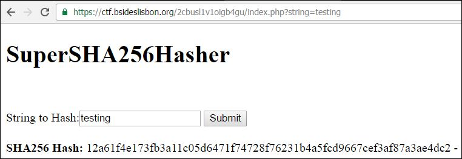
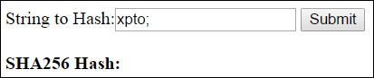
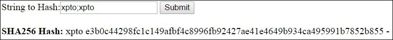
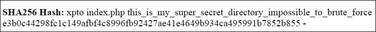
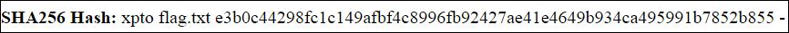

# 200 - Hasher
## One of my colleagues at All Safe ask me to test it's new algorithm. https://ctf.bsideslisbon.org/2cbusl1v1oigb4gu/

You would be presented with this interface:

Basically you had an input textbox and when you submited the value the server would return the sha256sum of that value.

If you tried several characters, you would notice that the char ";" and "|" makes the page to no longer return the hash. This may indicate that we are dealing with some sort of Command Injection.

Trying with some more text after the ";" char we would get our text append with the hash of the text after the ";" char:

If you tried the input "xpto;ls;xpto" the server would return:

With this you could then do "xpto;ls this_is_my_super_secret_directory_impossible_to_brute_force;xpto" and find out that there is a flag.txt file inside that directory.

Reading the content of the file you would get "everybody_loves_command_injection"

flag: everybody_loves_command_injection

